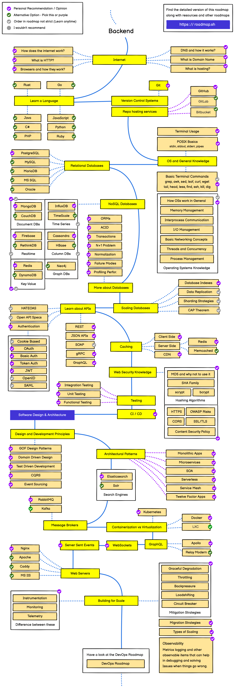

# follow-backend-roadmap

Backend Roadmap 을 따라 공부하면서 간단히 정리하기 위한 프로젝트 입니다.  

## Backend Roadmap

[Backend Developer Roadmap 출처](https://roadmap.sh/backend)

----

# 목차

- [Internet](#internet)   
- [Learn a Language](#learn-a-language)   
- [Version Control Systems](#version-control-systems)   
- [Git](#git)   
- [Repo hosting services](#repo-hosting-services)   
- [OS and General Knowledge](#os-and-general-knowledge)   
- [Relational Databases](#relational-databases)   
- [NoSQL Databases](#nosql-databases)
- [More about Databases](#more-about-databases)
- [Scaling Databases](#scaling-databases)
- [Learn about APIs](#learn-about-apis)
- [Caching](#caching)
- [Web Security Knowledge](#web-security-knowledge)
- [Testing](#testing)
- [CI/CD](#ci/cd)
- [Software Design & Architecture](#software-design-&-architecture)
- [Design and Development Principles](#design-and-development-principles)
- [Architectural Patterns](#architectural-patterns)
- [Message Brokers](#message-brokers)
- [Containerization vs Virtualization](#containerization-vs-virtualization)
- [GraphQL](#graphql)
- [WebSockets](#websockets)
- [Server Sent Events](#server-sent-events)
- [Web Servers](#web-servers)
- [Building for Scale](#building-for-scale)
- [Devops](#devops)

# Internet

- [How does the internet work?](./internet/how-does-internet-work.md)
- [What is HTTP?](./internet/what-is-http.md)

# Learn a Language

# Version Control Systems

# Git

# Repo hosting services

# OS and General Knowledge

# Relational Databases

# NoSQL Databases

# More about Databases

# Scaling Databases

# Learn about APIs

# Caching

# Web Security Knowledge

# Testing

- [JMeter](testing/jmeter.md)   

# CI/CD

# Software Design & Architecture

# Design and Development Principles

# Architectural Patterns

- [Layered Architecture](architecture/layered-architecture.md)   
- [Hexagonal Architecture](architecture/hexagonal-architecture.md)   

# Message Brokers

# Containerization vs Virtualization

## Docker

- [Docker](infrastructure/docker.md)   

# GraphQL

# WebSockets

# Server Sent Events

# Web Servers

# Building for Scale

# Devops