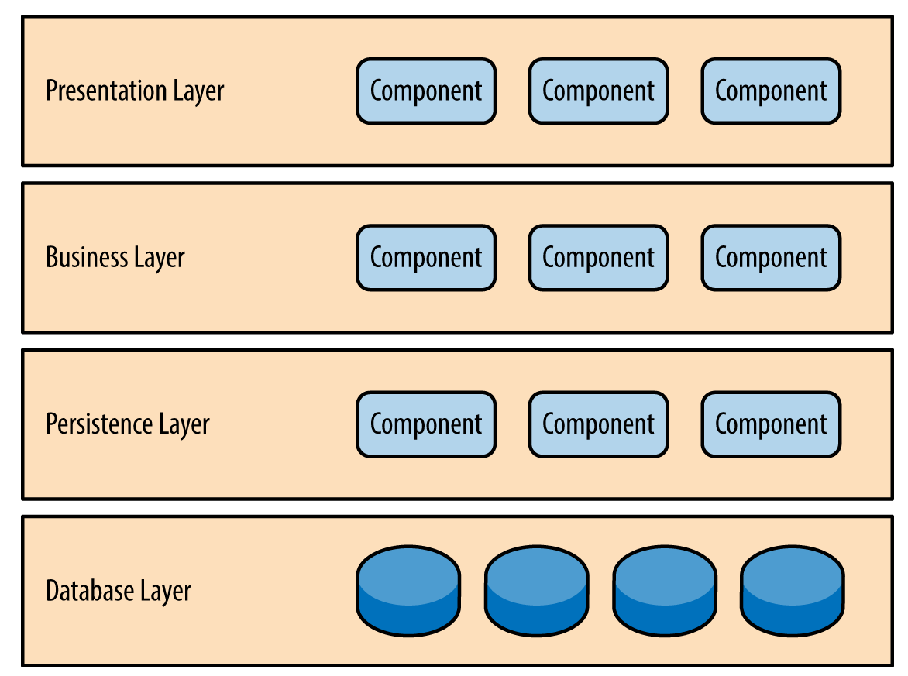

# Layered Architecture

# Layered Architecture 란?

Layered Architecture 는 많이 활용되는 아키텍처 중 하나로 다른말로는 N-Tier Architecture 라고도 한다. 비슷한 역할을 하는 component 들을 수평으로 묶어 여러개의 계층을 두는 Architecture 이며, 각 계층 별로 담당하는 역할이 다르기에 소스 수준에서 관심사의 분리를 할 수 있는 것이 장점이다.

# Architecture 구조도

- 4-tier 예시

## Presentation Layer

유저와의 인터페이스를 담당하는 Layer 로 유저로 부터 어떤 요청을 어떠한 형태로 받을 것인지 정하고 담당한다.

## Business Layer

비즈니스 규칙에 따라 요청 처리를 담당하는 Layer 이다.

## Persistence Layer

영속성을 위한 Layer 로 Database 와 통신을 주고 받아 Data를 저장하거나 불러오는 것 등을 담당하는 Layer 이다.

## Database Layer

DBMS 등이 존재하는 Layer이다.

# Reference

[https://www.oreilly.com/library/view/software-architecture-patterns/9781491971437/ch01.html](https://www.oreilly.com/library/view/software-architecture-patterns/9781491971437/ch01.html)