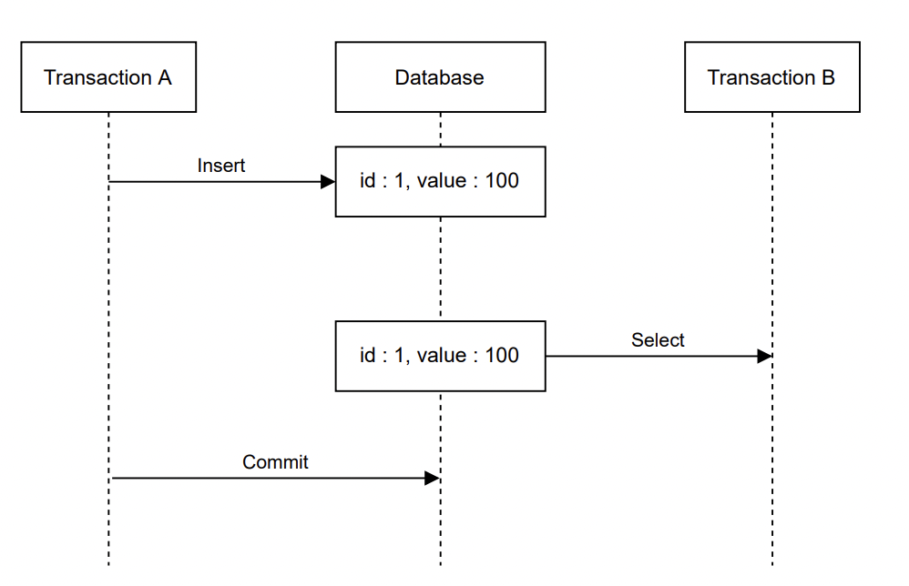
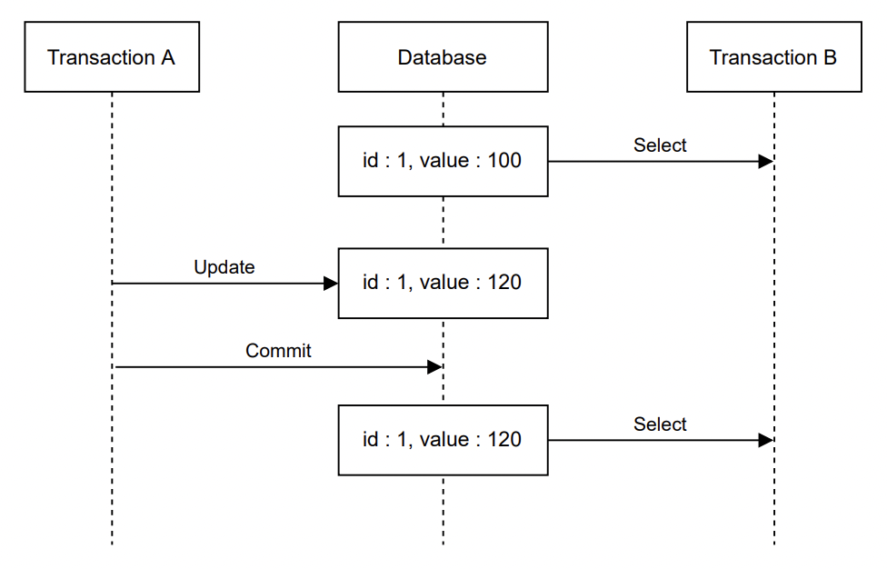
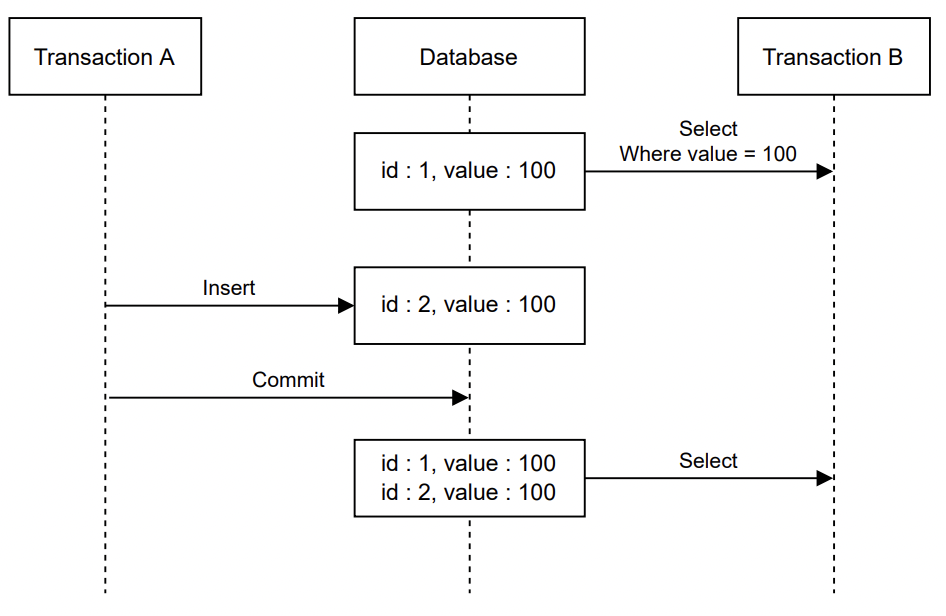

# Database Isolation Level

# 개요

트랜잭션 격리수준이란 동시에 실행 중인 다른 트랜잭션과 얼마나 격리 될것인지에 대한 수준을 나타내는 것이다. 트랜잭션 격리수준은 Dirty read, Non Repeatable read, Phantom read 현상을 어느정도까지 허용할 것인지를 정한다고 생각해도 좋다.

# DB 에서 트랜잭션 격리수준에 따라 발생 할 수 있는 현상

## Dirty read

한 트랜잭션에서 다른 트랜잭션의 아직 커밋되지 않은 데이터를 읽는 현상이다.

## Non repeatable read

한 트랜잭션에서 같은 row 를 두 번 읽었을 때 각 값이 다른 현상이다. 이는 한 트랜잭션이 select 를 한 이후에 다른 트랜잭션에서 해당 값에 대해 수정 후 commit 을 하였을 때 발생 할 수 있다.

## Phantom read

한 트랜잭션에서 두 개의 동일한 쿼리가 실행되었지만 두 쿼리에서 검색한 row 가 다른 현상이다. 즉 쿼리의 조건에 맞는 새로운 row가 생기는 것이다.

# 트랜잭션 격리수준

## Read uncommited

트랙잭션의 변경 내용이 commit 이나 rollback 되지 않아도 다른 트랜잭션에서 변경 내용을 검색할 수 있다. 이는 사실상 격리 수준이 없는 것과 같다.

## Read commited

다른 트랜잭션이 데이터를 변경 하였다고 하여도 commit 이 완료되었을때만 해당 값을 읽을 수 있다.

## Repeatable read

트랜잭션이 실행되는 동안 해당 row에 공유락을 발생 시키므로 다른 트랜잭션에서 해당 row에 변경 작업을 할 수 없게 된다. MySQL, Postgresql 등에서는 Repetable read level 에서 gap-lock 등을 적용하기에 Phantom read 도 발생하지 않는다.

## Serializable

트랜잭션이 실행되는 동안 해당 범위에 대해 공유락을 발생 시키므로 다른 트랜잭션에서 해당 범위의 데이터를 수정할 수 없다. 이는 해당 범위의 값을 갖는 데이터를 추가 하는 것도 허용하지 않는다는 의미이다. 이는 동시성을 매우 떨어뜨릴 수 있는 것으로 성능이 매우 떨어질 수 있다.

### 격리수준에 따른 발생 현상 정리

|  | Dirty read | Non repetable read | Phantom read |
| --- | --- | --- | --- |
| Read uncommited | O | O | O |
| Read commited | X | O | O |
| Repeatable read | X | X | O (MySQL, PostgreSQL 에서는 X) |
| Serializable | X | X | X |