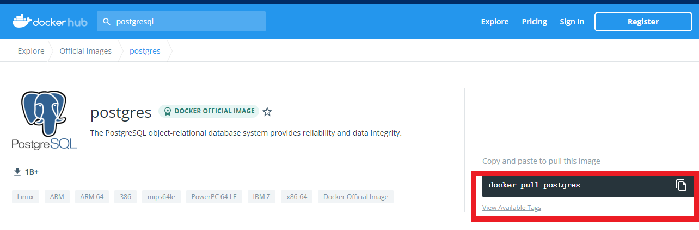
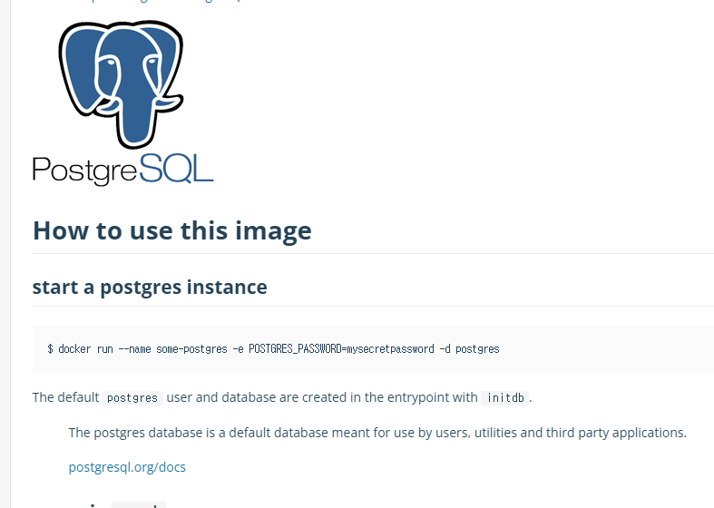

# Docker

# Docker 란?

도커는 2013년 오픈소스로 공개된 컨테이너 기반 가상화 플랫폼으로 실행환경 및 프로그램을 추상화 하여 동일한 인터페이스로 제공함으로 프로그램 배포 및 관리를 편하게 할 수 있도록 한다.

# 설치

## Docker Desktop

Docker 설치 및 관리를 편하게 하기 위해 Docker 에서 공식적으로 제공하는 어플리케이션

- [Docker 공식 페이지](https://docs.docker.com/get-docker/)

### Windows WSL 환경

Windows 에서 Docker 를 사용하기 위해서는 WSL 이 사용 가능한 상태여야 한다.

- [WSL 설치 MS 문서](https://docs.microsoft.com/en-us/windows/wsl/install)

## Docker Engine

Linux 등의 환경에서 Docker 의 핵심 기능만 필요하다면 Docker Engine 만을 설치 하면 된다.

- [Docker Engine 공식 페이지](https://docs.docker.com/engine/install/)

# Docker Hub

Docker 에서 운영하는 공식 Docker Image Repository 로 OS, DB, Web Server 등 유명한 어플리케이션의 공식 Docker Image 및 버전을 확인할 수 있으며, 자신만의 Docker Image 를 만들어 Upload 할 수도 있다.

- [Docker Hub](https://hub.docker.com/)

# 사용 예시

- Docker Hub PostgreSQL 공식 Image (Tag : latest) 를 pull 받아 컨테이너 생성 후 실행

## Docker Hub 에서 Image 및 Guide 확인

### PostgreSQL 공식 Docker Image 검색


### Docker Image Pull 방법 확인



### Docker Image 사용 방법 확인



## Docker Image Pull 및 Run

### Image Pull

```bash
# Docker Hub Image Pull 방법 확인
docker pull postgres
```


### Image 확인

```bash
docker images
```


### Container 실행

```bash
# Docker Hub Image 사용 방법 확인
docker run --name postgres-test -e POSTGRES_PASSWORD=testpassword -d postgres
```


### Container 확인

```bash
docker ps
```

