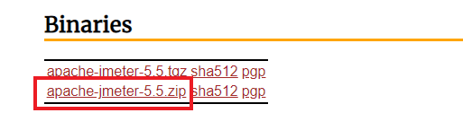
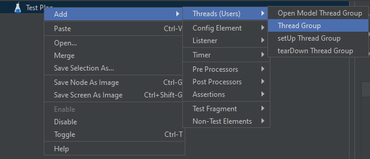
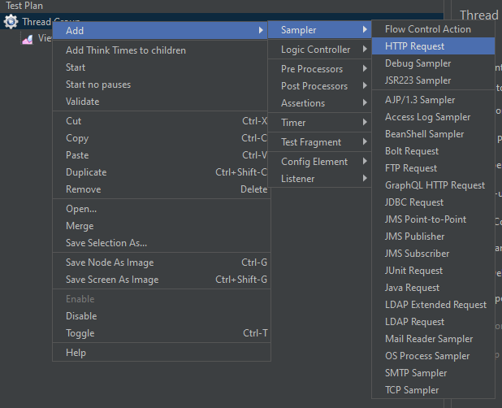
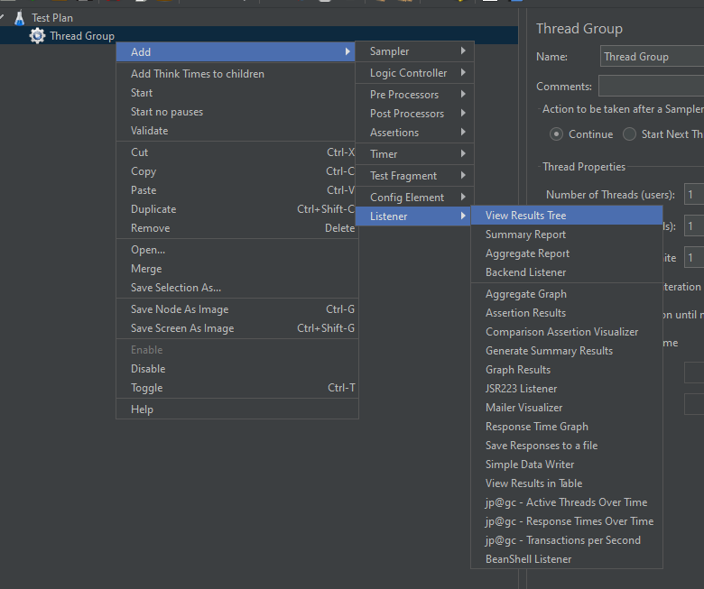
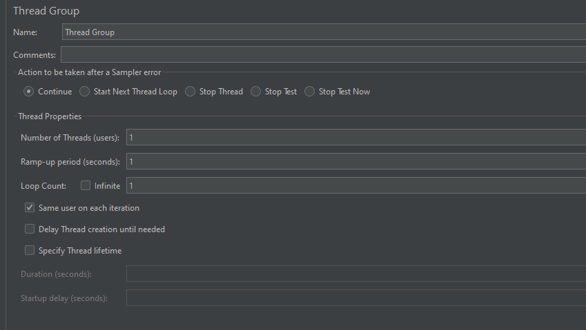
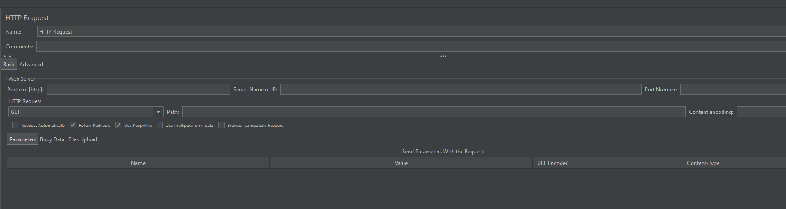
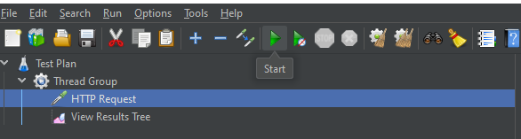

# Jmeter

# Jmeter 란?

Apache 에서 만든 오픈 소스 소프트웨어로 다양한 어플리케이션 환경에서 성능을 테스트 할때 사용할 수 있다.

# 설치 및 실행

<aside>
💡 JDK 설치 필요
OpenJDK  : [https://openjdk.org](https://openjdk.org/)

</aside>

## Mac

Apple silicon 환경 brew 사용

### 설치

```bash
brew install jmeter
```

### 실행

```bash
open /opt/homebrew/bin/jmeter
```

## Windows

### 설치

[https://jmeter.apache.org/download_jmeter.cgi](https://jmeter.apache.org/download_jmeter.cgi)



다운받은 zip 압축 해제

### 실행

{압축 해제한 경로}\bin\jmeter.bat 실행

# 사용 예시

### Thread Group 추가

Test Plan 우클릭 > Add > Threads (Users) > Thread Group



### Http Request Sampler 추가

Thread Group 우클릭 > Add > Sampler > HTTP Request



### Listener 추가

Thread Group 우클릭 > Add > Listner > 원하는 Listener 추가



### Thread Group 설정



- Number of Threads : 시뮬레이션 할 가상 유저의 수
- Ramp-up period : Thread 실행을 완료 시킬 시간
- Loop count : Test 반복 시간
- Same user on each iteration : 쿠키 및 캐시등의 데이터 재사용 여부 (유저 정보 유지)
- Delay Thread creation until needed : Thread 생성을 적절한 ramp-up 시간이 지난 후 할건지 여부
- Specify Thread lifetime : Thread 생명 주기 사용 여부
- Duration : Thread 종료 시간
- Startup delay : Thread 실행 지연 시간

### HTTP Request 설정

HTTP 통신을 테스트 할 path 정보 등을 입력



### 테스트 실행

